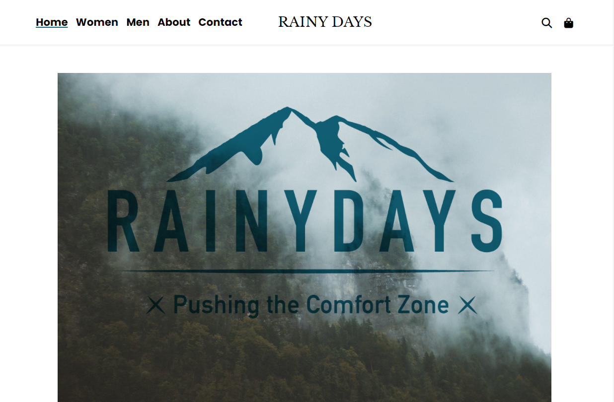

# Rainy Days



Rainy Days is an online clothing store specializing in high-quality outerwear designed for hiking and outdoor adventures. Catering to adults, the store combines a modern, clean, and serious design aesthetic with a user-friendly interface. This website is a school project created for the Front-End Development course at Noroff School of Technology and Digital Media.

## Description

Rainy Days is the destination for those seeking durable and stylish outerwear for hiking in the mountains and other outdoor activities. With a design ethos centered around seriousness, cleanliness, modernity, and high quality, Rainy Days aspires to resonate with adults who are passionate about the great outdoors. The store’s wide range of products is showcased through an intuitive navigation system, detailed filtering options, and high-resolution images. 

### Key Features

- Intuitive Search Bar: An easy-to-use search bar for users to quickly find the products they are looking for.

- Filter Options: Users can filter products by color and price range through a dropdown menu.

- Sort By Options: Allows users to sort products by price (low to high, high to low) and name (A to Z, Z to A).

- Product Categories: The website includes separate sections for men’s and women’s clothing.

- High-Quality Images: The store uses high-resolution images to give users a clear view of the products.

## Built With

- HTML
- CSS
- JavaScript
- WordPress REST API (Headless CMS)
- Figma (for design)

## Getting Started

### Installing

1. Clone the repo:

```bash
git clone git@github.com:jomolteberg/rainydays_final.git
```

2. Install the dependencies:

```
npm install
```

### Running

To run the app, run the following commands:

```bash
npm run start
```

## Contributing

Contributions are welcome! If you would like to contribute, please fork the repository and make changes as you'd like. Push your changes to your fork and submit a pull request. Please make sure to review your code before submitting.

## Contact

Feel free to contact me:

[LinkedIn](https://www.linkedin.com/in/john-oscar-molteberg-637177180/)

